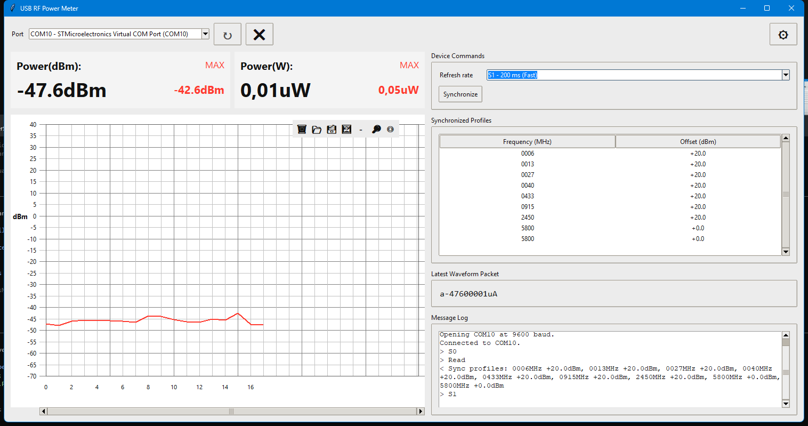

# USB RF Power Meter

Desktop implementation of the USB RF Power Meter control panel and live waveform chart.

100K-10GHZ USB RF power meter -55~+30dBm adjustable attenuation value + Antenna + Attenuator FOR Ham Radio Amplifier

<a href="app-screenshot.png">
  
</a>


## Features

- Refresh available COM ports.
- Connect and disconnect on the selected serial port.
- Fixed serial settings at `9600` baud.
- Send `Read`, `S0`, `S1`, and `S2` commands with `CRLF` termination.
- Parse continuous waveform packets such as `a-43300004uA`.
- Plot live dBm values on a scrolling chart with a fixed Y range of `-70 dBm` to `40 dBm`.
- Show synchronized frequency and offset pairs returned by the device.

## Device Protocol

### Streaming packet

Example:

```text
a-11407113uA
```

- `a`: fixed start marker
- `-114`: `-11.4 dBm`
- `07113`: `71.13 uW`

### Synchronize command

Command sent:

```text
Read\r\n
```

Example response:

```text
R0006+20.00013+20.00027+20.00040+20.00433+20.00915+20.02450+20.05800+00.05800+00.0
```

Each profile is parsed as:

- 4 digits: frequency in MHz
- signed decimal: dBm offset

### Refresh rates

- `S0\r\n`: Slow (1s)
- `S1\r\n`: Normal (200 ms)
- `S2\r\n`: Fast (500 ns)

## Run

1. Create and activate a virtual environment if you want one.
2. Install dependencies:

```bash
pip install -r requirements.txt
```

3. Start the application:

```bash
python main.py
```
